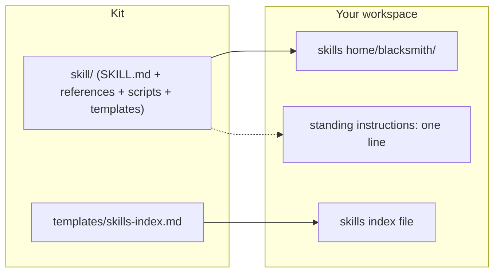

# Blacksmith: an implementation kit

This installs a standard for AI skill folders, plus the skill that applies it: it shapes a new skill from an approved plan, or checks a skill you already have against the standard and fixes the mechanical gaps behind a safety snapshot. Takes about 20 to 30 minutes to install, then 20 to 40 minutes for a first live run on one real skill (author's estimate, not yet cold-tested). You end up with the standard and the skill installed where your AI finds them, one line in your standing instructions, and one of your real skills checked and fixed.

Already installed `skill-creation-kit`? This replaces it; its method is retired.
Already installed `rome-kit`? This is the skill-structuring tool Rome's step 6 calls; the install wires it in.

## Where it lands

| From the kit | Lands at | Decided by |
|---|---|---|
| `skill/` | Your skills home, as `blacksmith/` | DP-1 |
| `skill/scripts/blacksmith.json` | Edited in place after the copy | DP-1, DP-3, DP-6 |
| `skill/templates/` (the plan card and the cold-read fixture) | Rides inside the skill, at `blacksmith/templates/` | Always; the plan card is used under DP-2 B |
| `templates/skills-index.md` | Your workspace | DP-6 B only |
| one line, not a file | Your standing-instructions file | Phase 2 step 7 |
| one line, not a file | Your build protocol's build step | DP-2 A only |

No new root folder unless you have none; your AI confirms each destination with you before writing.

## How to use it: three on-ramps

1. **You have a coding agent** (Claude Code, Cursor, Codex, Copilot Workspace, Amp, Claude Desktop with file access…): open this repo with it and say **"Read IMPLEMENT.md and walk me through it."** It scans your setup, presents six decisions, installs the standard and the skill, and runs the skill on one real, small skill of yours.
2. **You have a chat-only AI:** paste `IMPLEMENT.md` into the chat, follow along, create the files yourself, and keep `STATUS.md` as a note you paste back each session. The install is unchanged; a shell step becomes something you paste back the output of.
3. **No AI at all:** read `skill/SKILL.md` yourself. Both doors work as a checklist for any skill folder, with a person in the AI's seat.

**Model recommendation:** run the install, and every draft or cold read after it, on the most capable model you have, at high reasoning effort. A weaker model tends to agree with a folder instead of checking it.

## How it works

The standard says every skill has five things: a line before step 1 that says what a run is and what is out of scope; numbered steps where each step names what it reads and what it produces; one block of rules, one per line, each carrying who set it or what it cost; every file the skill remembers between runs named by path; and one ending that says what was produced. Six yes-or-no flags add blocks on top: does the skill hand work to sub-agents, keep state outside its folder, take an action that cannot be undone, keep you in the loop turn by turn, ship something to an outsider, or run unattended? A skill with no flag set is a leaf: it gets a time budget and nothing else, and it is forbidden the scaffolding.

There are two doors. Door 1 is for a new skill: you (or your build protocol) hand over an approved plan, and the skill drafts the folder from it, checks the six flags, homes the folder where your AI finds it, and runs the check before calling it done. Door 2 is for a skill you already have: it reads the whole folder, diffs it against the standard, and reports the gaps in two buckets: Needs you (a judgment call, with a recommendation and why) and Mechanical (a fixed, pre-approved list: things like a missing close line, a dead file path, a placeholder left in by mistake). Mechanical items apply without asking; everything else waits for your word.

The check has two halves. The mechanical half is ten fixed checks (name, description, size, paths, close line, placeholders, feedback-loop files, discovery, registry, fixture), run by script or by hand. The other half is a cold read: a reader with no memory of your setup follows the skill from its own files on one real prompt, so you see whether a stranger could use it.

Every door 2 edit sits behind a snapshot: the folder is copied first and the restore command is printed, so a bad edit is one command from undone.

Once a skill is live, its close line asks how deep the feedback loop should go after each run: 1 logs one row, 2 adds a re-read for the rule the run bent and a one-line fix proposed to you, 3 adds a fresh read of the output a day later.

## What's in here

| Path | What it is |
|---|---|
| `AGENTS.md` / `CLAUDE.md` | Entry instructions for coding agents that auto-read those files |
| `README.md` | This file |
| `IMPLEMENT.md` | The installer script, written to your AI (humans can follow it too) |
| `STATUS.md` | Install progress: scan results, decisions, phase ticks; the resume spine |
| `EXAMPLE.md` | Door 2 walked end to end on a small, deliberately messy skill, with real outputs pasted |
| `example/dirty-skill/SKILL.md` | The messy skill, before |
| `example/clean-skill/` | The same skill, after door 2: `SKILL.md` and the pantry note it reads |
| `skill/SKILL.md` | The standard's skill, in portable agent-skill format |
| `skill/references/standard.md` | The standard itself: the five things, the six flags, rule form, frontmatter, the folder table |
| `skill/references/check-by-hand.md` | The same ten checks as a paste-free checklist, for a setup with no shell |
| `skill/scripts/check.py` | The mechanical check, Python 3.9 or later, standard library only |
| `skill/scripts/blacksmith.json` | The skill's settings; Phase 2 edits it for your decisions |
| `skill/templates/plan-card.md` | The card a user fills before door 1 when no build protocol hands one over |
| `skill/templates/fixture.md` | The cold-read fixture template: paths only, never pasted content |
| `templates/README.md` | Install matrix: each template, the decision that gates it, where it lands |
| `templates/skills-index.md` | A table of your skills, if you want one and don't already have it |

## What you end up with

- The **standard**, and the skill that applies it, installed where your AI finds it.
- A **snapshot habit** so a door 2 fix is always reversible.
- A **feedback loop** so a skill improves from its own runs.
- A line in your AI's **standing instructions** so the skill fires from your own words.
- **One real skill of yours**, checked, with what changed shown by file and line.

Honest provenance: this is one operator's house standard, built from running it against a working fleet of 33 skills, not an industry standard. Keep what fits your own skills and drop what doesn't.
